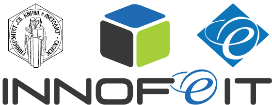
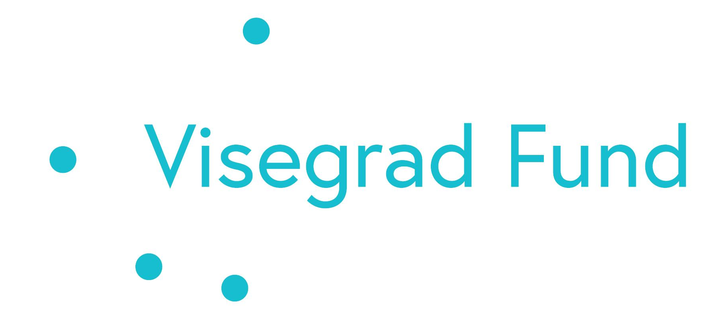

# 4ACEs WebApp

A simple web-app for cognitive training targeting people with Alzheimer that shows a sentence, hides it, then presents three images. The player must click the image that matches the word. A point is scored for each correct choice. The game ends after 10 rounds.

---

## 📜 Table of Contents

- [About the Project](#-about-the-project)
- [✨ Features](#-features)
- [🚀 Getting Started](#-getting-started)
- [🐳 Deployment](#-deployment)
- [🌐 Adding a New Language](#-adding-a-new-language)
- [🤔 Troubleshooting](#-troubleshooting)
- [📄 License](#-license)
- [🙏 Acknowledgements](#-acknowledgements)

---

## 📖 About the Project

The 4ACEs WebApp is designed and deployed within the scope of the AI Apps Against Alzheimer in Central Europe (4ACEs) funded by the Visegrad Fund. The project brings together 3 leading institutions from the Visegrad 4 region with expertise in AI-based diagnosis and treatment of neurodegenerative diseases, and INNOFEIT with its expertise with innovation and development.

**Project partners:**

*  Institute of Informatics, Slovak Academy of Sciences (UISAV), Bratislava, Slovakia
*  Budapest University of Technology and Economics (TMIT), Budapest, Hungary
*  Warsaw University of Technology (WUT), Warsaw, Poland
*  INNOFEIT, Skopje, Macedonia (lead partner)

For more information, visit the [project website](https://inno.feit.ukim.edu.mk/4aces/).

---

## ✨ Features

-   **🎮 Gamified cognitive training:** A simple and engaging game to help with cognitive training.
-   **🌐 Multilingual support:** Supports English, Hungarian, Macedonian, Polish, Slovak, and Serbian.
-   **🗣️ Text-to-Speech:** Each sentence is read out loud in the selected language.
-   **🖼️ Image-based questions:** Users select an image that matches a sentence.
-   **💯 Scoring system:** Keeps track of the player's score.
-   🌐 **Easy language adding:** A set of scripts to easily add new languages.

---

## 🚀 Getting Started

### Prerequisites

-   Python 3.9+
-   pip
-   Node.js and npm
-   (Optional) virtualenv
-   Docker

### Local Development

1.  **Install Python Dependencies**:
    ```bash
    # Create and activate a virtual environment (recommended)
    python -m venv venv
    source venv/bin/activate   # on Windows use `venv\Scripts\activate`
    pip install -r backend/requirements.txt
    ```

2.  **Prepare the Frontend**:
    ```bash
    npm install
    npm run build
    ```
    To automatically rebuild on changes, run `npm run watch`.

3.  **Run the Application**:
    ```bash
    python backend/app.py
    ```
    The server will start on [http://localhost:5000](http://localhost:5000).

---

## 🐳 Deployment

The recommended way to run the application is using Docker.

1.  **Build the Docker image**:
    ```bash
    docker build -t 4aces-webapp .
    ```

2.  **Run the Docker container**:
    ```bash
    docker run -d -p 8080:80 --name 4aces-app 4aces-webapp
    ```
    The application will be accessible at [http://localhost:8080](http://localhost:8080).

---

## 🌐 Adding a New Language

A set of Python scripts is provided to streamline the process of adding a new language. For detailed instructions, please refer to the [README in the `add_new_language` directory](add_new_language/README.md).

---

## 📄 License

This project is licensed under the GNU Affero General Public License v3.0. See the [LICENSE](LICENSE) file for details.

---

## 🙏 Acknowledgements

The 4ACEs project is funded by the [Visegrad Fund](https.www.visegradfund.org/).


